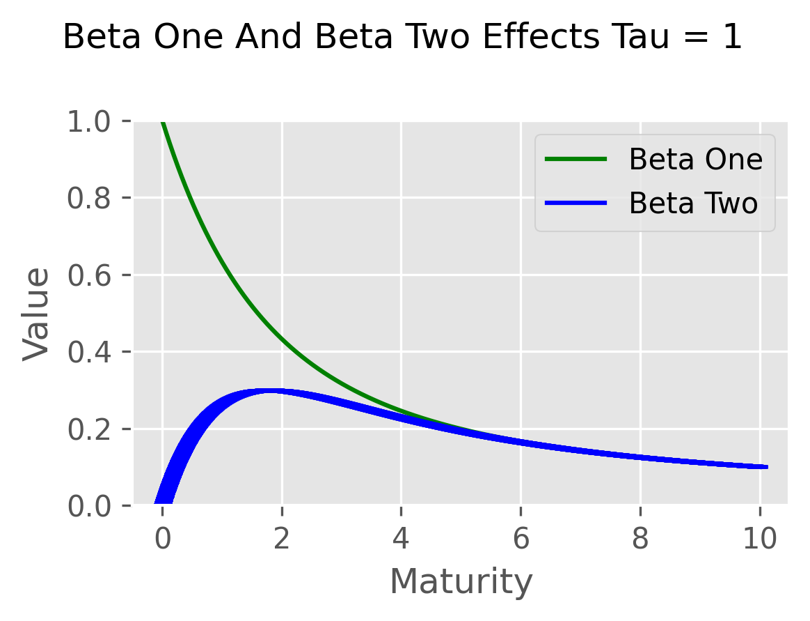
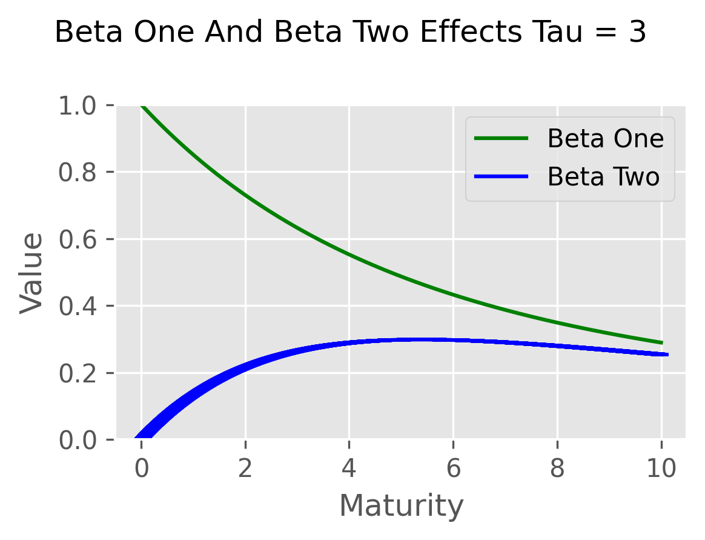

# Why the Nelson-Siegel Model

## Modeling the term structure as a continuous function of maturity

In Chapter Three, ordinary least squares (OLS) was used to estimate zero prices utilizing 302 bonds. These estimates spanned maturities ranging from a few days to almost ten years. In total, 193 discrete zero prices were estimated to cover a timeline of more than 3,600 actual days. Moreover, we were only able to use 302 of the 399 bonds included in our dataset resulting in sparse estimates at discrete dates and a truncated maturity profile.

Many interpolation methods exist offering varying degrees of accuracy for filling these gaps. A common approximation applies a cubic spline between adjacent estimates. Although this results in a smooth, continuous curve, the purely mathematical process ignores the underlying structure of the data. Consider an analogy: if you know a dataset is generated by a sine wave, you only need to estimate four parameters to perfectly map every point on the curve. A cubic spline, however, is heavily dependent on the number of observations; it requires calculating new polynomial coefficients for every single interval between data points. Because it ignores the underlying "shape" of the data, a spline cannot reliably extrapolate maturities beyond our truncated OLS estimates.

Nelson and Siegel (1987) address the problem by focusing on three attributes of the term structure of interest rates:

1. **The Level:** The most basic question is the level of interest rates- whether rates are high or low.    
2. **The Slope**: The slope indicates if the rates are increasing or decreasing with maturity.  A result that might reflect expectations about current and future expectations of inflation or monetary policy.  
3. **The Shape**: The shape indicates if there is a so-called hump in the term structure. A period when the pattern of rates and maturity deviates from the underlying slope - an increase or decrease in rates that is reversed.  
   
$$r(t)=\beta_0+\beta_1\left(\frac{1-e^{-t/\tau}}{t/\tau}\right)+\beta_2\left(\frac{1-e^{-t/\tau}}{t/\tau}-e^{-t/\tau}\right)$$


Where $r(t)$ is the spot rate of interest for period $t$. The model relies on four key parameters—$\beta_0$, $\beta_1$, $\beta_2$, and $\tau$—which directly correspond to the term structure attributes defined above:

1. The Level ($\beta_0$): Represents the asymptotic, long-term spot interest rate.

2. The Slope ($\beta_1$): Dictates the short-term component, modifying the long-term rate based on the maturity date.

3. The Shape ($\beta_2$): Controls the medium-term curvature, determining the magnitude and direction of the hump.

4. Scaling ($\tau$): Acts as a decay factor, scaling the rate at which the slope and shape components influence the curve across maturities.

The intuition of the model is not immediately apparent.  Below we identify the short rate ($r(0)$), the long rate ($r(∞)$), and how $\tau$ affects the estimates.  This analysis requires algebraic manipulation and taking the limits as t and $\tau$ go to zero and infinity.  

## Exploring the Parameters of the Nelson-Siegel Model

### The Short Rate: $r(0)= \beta_0+ \beta_1$
The short rate of interest equals the spot rate at $t = 0$. To determine how $r(0)$ relates to the model's parameters, we evaluate the limit of the Nelson-Siegel function as $t$ approaches zero:
$$r(0) = \beta_0 + \beta_1 \lim_{t \to 0} \left( \frac{1-e^{-t/\tau}}{t/\tau} \right) + \beta_2 \lim_{t \to 0} \left( \frac{1-e^{-t/\tau}}{t/\tau} - e^{-t/\tau} \right)$$


````{dropdown} 🔍 Click to see the derivation of the short rate ($\large{t \to 0}$)

To resolve the limit of the fraction $\frac{1-e^{-t/\tau}}{t/\tau}$, we can express $e^{-x}$ using its Maclaurin series (a Taylor expansion at zero):

$$e^{-x} = 1 - x + \frac{x^2}{2!} - \frac{x^3}{3!} + \dots$$

Subtracting this series from 1 yields:

$$1 - e^{-x} = x - \frac{x^2}{2!} + \frac{x^3}{3!} - \dots$$

We can then factor out $x$ so that it multiplies the infinite sum:

$$1 - e^{-x} = x \left( 1 - \frac{x}{2!} + \frac{x^2}{3!} - \dots \right)$$

Applying this logic to the Nelson-Siegel model by substituting $x = t/\tau$, the numerator of the slope variable becomes:

$$1 - e^{-t/\tau} = \frac{t}{\tau} \left( 1 - \frac{t/\tau}{2!} + \frac{(t/\tau)^2}{3!} - \dots \right)$$

Dividing this by the denominator ($t/\tau$) cancels the leading term:

$$\frac{1-e^{-t/\tau}}{t/\tau} = 1 - \frac{t/\tau}{2!} + \frac{(t/\tau)^2}{3!} - \dots$$

As $t$ approaches zero, all terms containing $t$ vanish. Therefore, the limit of the fraction is simply $1$.

For the shape parameter ($\beta_2$), we also evaluate the limit of $e^{-t/\tau}$ as $t$ goes to zero, which is $1$. This makes the entire limit for the $\beta_2$ component evaluate to $1 - 1 = 0$.

Substituting these limits back into our original expression reveals that the short rate is defined entirely by the first two parameters:

$$r(0) = \beta_0 + \beta_1(1) + \beta_2(0)$$

$$r(0) = \beta_0 + \beta_1$$
````

## Exploring the parameters of the Nelson and Siegel model: the long rate $r(\infty) = \beta_0$

````{dropdown} 🔍 Click to see the derivation of the long rate ($t \to \infty$)


The long spot rate is the limit of the Nelson-Siegel model as $t$ approaches infinity:

$$r(\infty) = \beta_0 + \beta_1 \lim_{t \to \infty} \left( \frac{1-e^{-t/\tau}}{t/\tau} \right) + \beta_2 \lim_{t \to \infty} \left( \frac{1-e^{-t/\tau}}{t/\tau} - e^{-t/\tau} \right)$$

As $t$ approaches infinity, the exponential term $e^{-t/\tau}$ approaches $0$. 

For the slope variable ($\beta_1$), the numerator approaches $1$ while the denominator ($t/\tau$) grows infinitely large. Dividing a finite number by an infinitely large number results in zero. Therefore, the limit of the slope component is:

$$\lim_{t \to \infty} \frac{1-e^{-t/\tau}}{t/\tau} = 0$$

For the shape variable ($\beta_2$), the limit of the entire expression also evaluates to zero, as we are subtracting $0$ from the fraction we just proved evaluates to $0$:

$$\lim_{t \to \infty} \left( \frac{1-e^{-t/\tau}}{t/\tau} - e^{-t/\tau} \right) = 0 - 0 = 0$$

Substituting these zero limits back into the original expression leaves us with the long rate of interest:

$$r(\infty) = \beta_0 + \beta_1(0) + \beta_2(0)$$

$$r(\infty) = \beta_0$$
````
### The Shape Parameter: What happens in the middle?

As established by our limit derivations, the mathematical component tied to the shape parameter ($\beta_2$) evaluates to zero at both the very short end ($t \to 0$) and the very long end ($t \to \infty$).$$\text{Shape Component} = \left( \frac{1-e^{-t/\tau}}{t/\tau} - e^{-t/\tau} \right)$$If this component begins at zero and ultimately decays back to zero, its value must rise and fall in the intermediate maturities. This creates a hump-like mathematical structure. This is why $\beta_2$ is referred to as the shape (or curvature) parameter. It has no effect on the overnight rate and no effect on the thirty-year rate; instead, it flexes the middle of the yield curve.

|  |  |
|:---:|:---:|

### Visualizing the Factor Loadings

The behavior of the slope and shape parameters can be clearly visualized by plotting their mathematical components (often called factor loadings) cross various maturities. In the graphs above, the green line represents the loading for the slope parameter ($\beta_1$), and the blue line represents the loading for the shape parameter ($\beta_2$).

#### The Slope (Green Line):
As our limits proved, the impact of $\beta_1$ begins at 1.0 for a maturity of zero and smoothly decays toward zero as maturity increases.

#### The Shape (Blue Line):

The impact of $\beta_2$ begins at zero, rises to a distinct "hump," and eventually decays back to zero for long maturities.

### The Role of $\tau$:

Comparing the two plots perfectly illustrates the function of the scaling parameter, $\tau$. When $\tau = 1$ (left), the slope decays rapidly, and the shape parameter's hump peaks at approximately 1.8 years. When $\tau = 3$ (right), the entire timeline is stretched. The slope decays much more gradually, and the maximum impact of the curvature is pushed out to roughly 5.4 years. By optimizing $\tau$, the Nelson-Siegel model can shift this hump to accurately match where curvature is occurring in observed market data.


Small values of $\tau$ push all spot rates toward the long rate, while large values do just the opposite—anchoring the entire curve near the short rate. We can observe this mathematically by looking at the extreme limits of the scaling parameter, $\tau$.

**When $\tau$ approaches zero:**

As $\tau \to 0$, the value $t/\tau$ approaches infinity. Consequently, the exponents of $e$ (which are $-t/\tau$) approach negative infinity, causing $e^{-t/\tau}$ to approach $0$. 

$$t/\tau \to \infty$$

$$\frac{1-e^{-t/\tau}}{t/\tau} \to 0$$

$$\frac{1-e^{-t/\tau}}{t/\tau} - e^{-t/\tau} \to 0$$

Because both the slope and shape components collapse to zero, the term structure becomes completely flat at the long rate:

$$\lim_{\tau \to 0} r(t) = \beta_0$$

**When $\tau$ approaches infinity:**

Conversely, as $\tau \to \infty$, the value of $t/\tau$ approaches $0$. As proved earlier with the short rate derivation, when the input to these fraction components approaches zero, the slope component evaluates to $1$ and the shape component evaluates to $0$.

$$t/\tau \to 0$$

$$\frac{1-e^{-t/\tau}}{t/\tau} \to 1$$

$$\frac{1-e^{-t/\tau}}{t/\tau} - e^{-t/\tau} \to 0$$

Therefore, the term structure becomes completely flat at the short rate:

$$\lim_{\tau \to \infty} r(t) = \beta_0 + \beta_1$$

## Summarizing the Nelson-Siegel Model
As demonstrated by the limit derivations, the influence of the slope and shape variables naturally dissipates at longer maturities. The exact rate of this dissipation depends entirely upon the scaling parameter, $\tau$. Because the Nelson-Siegel model relies on only these few parameters, it is highly parsimonious—allowing it to accurately capture complex, real-world term structures while avoiding the overfitting and extrapolation issues common in purely mathematical interpolation methods like cubic splines. We now introduce a widely used extension of this model incorporating additional parameters allowing for a second change in the shape (or a secondary hump) of the term structure.

## The Svensson Extension

The Nelson-Siegel model is remarkably flexible, but its single shape parameter limits it to modeling term structures with only one hump or dip. Sometimes the term structu8re exhibit more complex, "S-shaped" patterns, featuring both a hump and a trough at different maturities. To accommodate this, Lars Svensson (1994) introduced a widely adopted extension. The Svensson model adds a second curvature term to the equation, bringing the total number of parameters to six:

$$r(t) = \beta_0 + \beta_1 \left( \frac{1-e^{-t/\tau_1}}{t/\tau_1} \right) + \beta_2 \left( \frac{1-e^{-t/\tau_1}}{t/\tau_1} - e^{-t/\tau_1} \right) + \beta_3 \left( \frac{1-e^{-t/\tau_2}}{t/\tau_2} - e^{-t/\tau_2} \right)$$

Notice that the original scaling parameter is now denoted as $\tau_1$. The two new parameters operate almost identically to the first shape component, but they control a secondary hump.

### The Second Shape ($\beta_3$):
Controls the direction and magnitude of a second curvature in the yield curve. The Second Scaling ($\tau_2$) determines the specific maturity where this second hump or dip reaches its maximum impact. By utilizing two distinct scaling parameters ($\tau_1$ and $\tau_2$), the model can place one hump in the short-to-medium term and a second hump in the longer term, offering greater accuracy when fitting complex market data.

## The original Nelson-Siegel model versus the model with the Svensson Extension: Flexibility vs. Overfitting

The addition of the $\beta_3$ and $\tau_2$ parameters in the Svensson extension provides immense flexibility, allowing the model to trace complex yield curve anomalies. The increased flexibility introduces a classic econometric problem: overfitting. A highly parsimonious model like the four-parameter Nelson-Siegel framework effectively filters out "noise"—such as the idiosyncratic mispricing of individual bonds or temporary liquidity premiums—and captures the true shape of the term structure. Adding the Svensson parameters makes for a more sensitive model that applied to a sparse dataset may twist and contort to fit the pricing errors of specific bonds. The in-sample fit may improve, the model's ability to extrapolate or price out-of-sample bonds reliably may degrade.

### When to Use the extended model?
Choosing between the standard Nelson-Siegel model and the Svensson extension depends entirely on the complexity of the observed market and the density of the dataset.

####  The standard Nelson-Siegel model (4 Parameters):
Should be the default choice for standard market conditions. It is highly stable, robust to sparse data, and perfectly capable of mapping monotonic (upward, downward, or flat) and single-humped curves.

#### The Svensson Extension (6 Parameters):
Should be reserved for specific market environments where the yield curve exhibits a clear, observable "S-shape" or double hump. Many central banks utilize the Svensson model to publish their official daily yield curves, but they rely on densely populated datasets of highly liquid bonds. For smaller datasets—such as our sample of 399 bonds—the extension is only justified when there is a clear secondary hump in the data. A characteristic that is not present in our dataset.